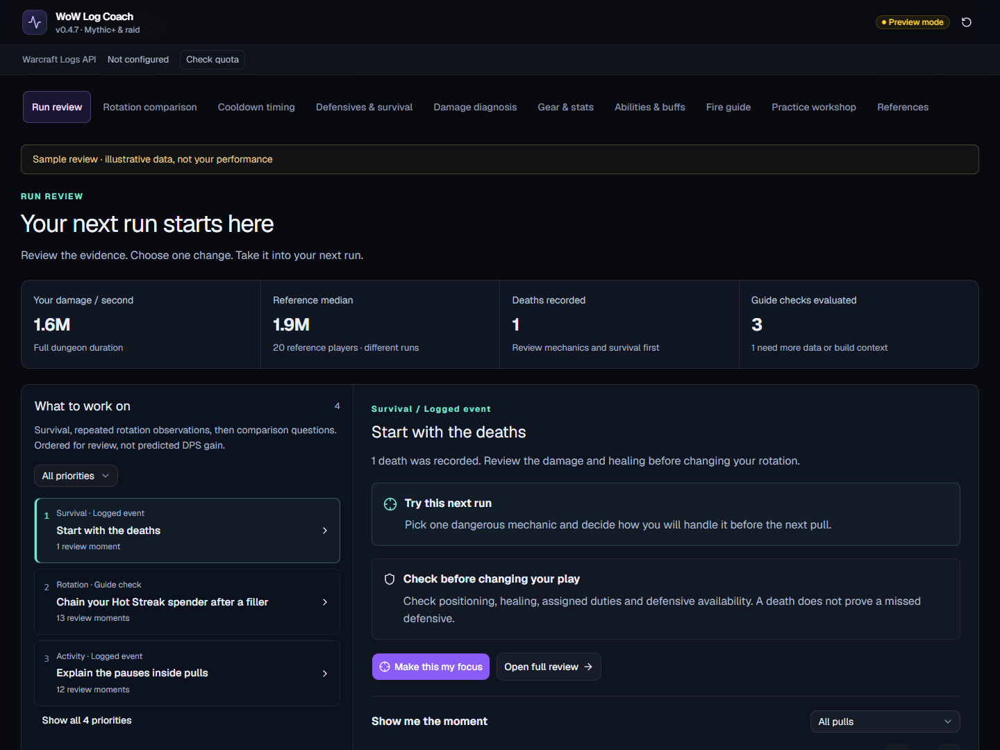
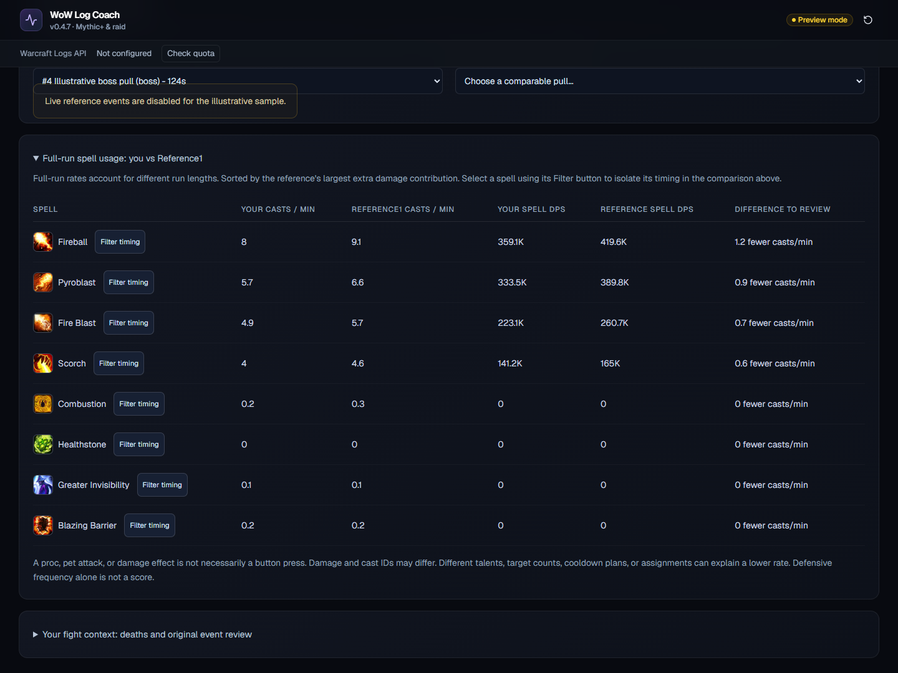
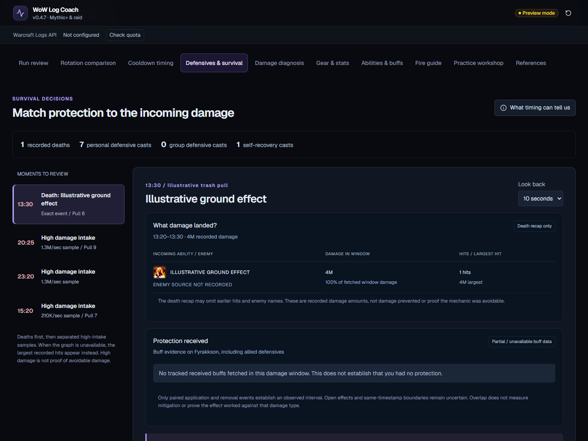
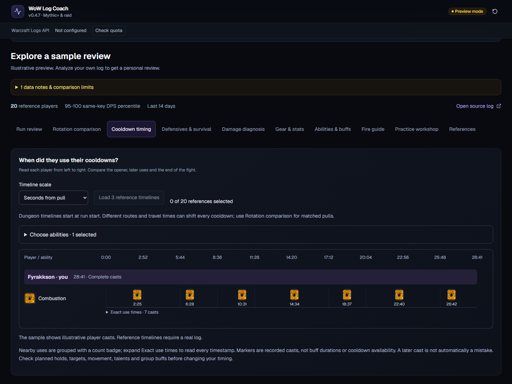

# WoW Log Coach

**Understand what happened in your run, compare it with stronger performances, and choose what to practice next.**

WoW Log Coach is a local World of Warcraft DPS review app for **Mythic+ runs and raid boss kills**. Paste a public Warcraft Logs report, pick your character, and explore rotation, cooldown timing, incoming damage, defensive support, gear, and reference-player differences in one place.

[Download v0.4.7](https://github.com/tnt1576-a11y/wow-log-coach/releases/tag/v0.4.7) · [Setup](LOCAL-SETUP.md) · [User guide](docs/USER_GUIDE.md) · [Features](docs/FEATURES.md)



*Screenshots use the built-in illustrative sample. They do not show a real player's report or establish current-patch rotation advice.*

## What it helps you review

| Question | Where to look |
| --- | --- |
| What should I work on first? | Run review highlights supported priorities, timestamps, and practical follow-up checks. |
| What did another player cast differently? | Rotation comparison shows equal-duration cast sequences, spell counts, and timing tracks. |
| When did players use cooldowns? | Cooldown timing lines up recorded casts from pull start, in seconds or fight percentage. |
| What hit me, and what protection was active? | Defensives & survival connects damage sources and danger windows with personal and external defensives. |
| Did gear or stats help explain the gap? | Gear & stats compares recorded equipment, item level, raw stats, gems, and enchants. |
| Which spells account for the damage difference? | Damage diagnosis and Abilities & buffs compare output, cast frequency, and recorded buff uptime. |
| Who am I being compared with? | References lists the qualifying players, filters, sample size, and reasons candidates were excluded. |

## Try it locally

You need **Node.js 24 or newer** and internet access for installation. The sample works without Warcraft Logs credentials.

**Windows:** download and extract the local ZIP from the release above, run `SETUP_LOCAL.cmd`, then `START_LOCAL.cmd`.

**From source, on Windows, macOS, or Linux:**

```sh
git clone https://github.com/tnt1576-a11y/wow-log-coach.git
cd wow-log-coach
npm ci --include=dev
node scripts/setup-local-env.mjs
npm run build
npm run start
```

Open **http://127.0.0.1:3000** and choose **Explore a sample review**. The local launcher does not require a login or app password.

For real reports, create your own [Warcraft Logs API v2 client](https://www.warcraftlogs.com/api/clients/), enter its client ID and secret in the generated `.env.local`, and restart the app. Follow the [setup guide](LOCAL-SETUP.md) for details. Credentials stay on your local server; never put them in an issue, screenshot, or shared ZIP.

## A closer look

### Compare rotations in context

Inspect a target and reference in the same length of time. Select pulls explicitly when the encounter cannot be matched reliably.



*The sample includes spell-level comparisons; detailed reference event streams require a real log.*

### Review incoming damage and defensive support

Choose a danger moment, inspect damage sources, and compare personal defensive casts and recorded external protection. A cast after a hit does not establish protection before it.



### Compare cooldown timing

See when abilities were actually cast, including raid cooldown planning against boss-kill duration. Reference event streams load on demand.



## Supported comparisons

- **Mythic+:** timed runs, DPS characters, same dungeon, exact key level, specialization, and ranking partition. Affix matching applies below +12; the app treats +12 and above as the fixed-affix tier.
- **Raids:** completed Normal, Heroic, and Mythic boss kills, matching boss, difficulty, specialization, and ranking partition. Kill-duration tolerance defaults to ±20%. Wipes and LFR are not matched to ranked kills.
- **References:** up to 20 distinct players, chosen by individual DPS rankings. Defaults are 95–100 percentile and the last 14 days. Strict filters can produce fewer matches; the app does not silently widen them.
- **Spec guides:** additional Mythic+ checks for Arcane, Fire and Frost Mage; Shadow Priest; Survival Hunter; Fury and Arms Warrior; Demonology Warlock; Windwalker Monk; Frost and Unholy Death Knight; Elemental Shaman; Assassination and Outlaw Rogue. Coverage varies by spec, build, patch, and recorded evidence. See [features and limits](docs/FEATURES.md).

## API usage and evidence limits

Each search checks at most **60 candidates across up to three ranking pages**. Reviews have a spending allowance of **up to 600 points**, reduced when quota is low. Completed references remain available after a spending stop. Request costs vary, so this is an estimated guard, not a guaranteed exact bill.

The top bar shows the last known Warcraft Logs balance and reset countdown. Idle tabs do not poll Warcraft Logs. **Check quota** explicitly refreshes it; normal API responses also update it.

Higher DPS alone does not prove a rotation mistake. Pull size, route, fight length, gear, talents, raid assignments, and external buffs matter. Missing evidence stays unknown. Fewer than eight references suppresses cohort-based coaching conclusions, while supported individual event checks remain available. No guaranteed recoverable-DPS or optimal-rotation score is claimed.

## Development and security

Built with TypeScript, React, vinext/Vite, and the Warcraft Logs GraphQL API. Run locally; publishing this repository does not deploy a website.

See [security and credential handling](SECURITY.md) and [third-party notices](THIRD_PARTY_NOTICES.md). CI checks types, lint, production builds and Git history for secrets. These checks do not need Warcraft Logs credentials.

This is an independent fan project, not affiliated with Blizzard Entertainment, Warcraft Logs, or Wowhead. Game artwork and third-party materials retain their respective ownership. No additional source-code license is granted by this release.
